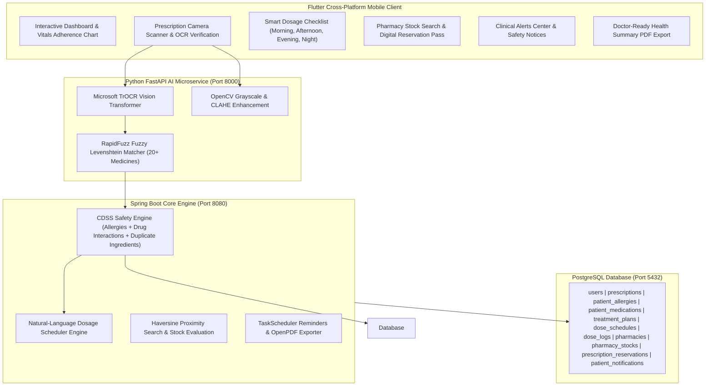

# 🏥 Smart Healthcare System — AI-Powered Prescription OCR & Clinical Decision Support

A modern, production-grade healthcare platform combining **Python AI Microservices** (TrOCR + OpenCV + RapidFuzz), **Spring Boot CDSS Safety Engine**, and a **Flutter iOS & Android Mobile Client**.

---

## 🌟 System Highlights & Key Features



---

## 🚀 Quick Start & Single-Command Launch

### Option 1: Docker Compose (Recommended)
Launch PostgreSQL, Python AI microservice, and Spring Boot backend simultaneously:

```bash
docker-compose up --build
```

### Option 2: Local Development Setup

#### 1. Start Python AI Microservice:
```bash
cd ai-service
source venv/bin/activate
pip install -r requirements.txt
python3 main.py
```
*(Runs on `http://localhost:8000`)*

#### 2. Start Spring Boot Core Engine:
```bash
cd backend
./mvnw spring-boot:run
```
*(Runs on `http://localhost:8080`)*

#### 3. Start Flutter Mobile App:
```bash
cd frontend
flutter pub get
flutter run
```

---

## 📊 Core System Modules

### 1. 🤖 Hybrid TrOCR + Tesseract AI Engine
- **TrOCR Base Handwritten Model**: High-precision Transformer-based OCR for handwritten doctor notes.
- **OpenCV Image Processing**: Contrast Limited Adaptive Histogram Equalization (CLAHE) for low-light scans.
- **Fuzzy Levenshtein Matcher**: Matches noisy OCR extractions against standard database medicines with sub-second latency.

### 2. 🛡️ Clinical Decision Support System (CDSS)
- **Patient Safety Profile**: Stores drug allergies (`HIGH`, `MEDIUM`, `LOW` severity) and active medications.
- **3-Pillar Safety Check**:
  - 🔴 **Drug Allergy Detection**: Flags conflict between prescribed items and patient allergies.
  - 🟠 **Drug-Drug Interactions**: Evaluates interactions between newly prescribed medicines and existing active drugs (e.g. `Warfarin` + `Aspirin`).
  - 🟡 **Duplicate Ingredients**: Prevents accidental double dosing of active pharmaceutical ingredients.

### 3. ⏰ Digital Treatment Plan & Adherence Analytics
- **Natural Language Dosage Parser**: Converts medical instructions (e.g., *"Take twice daily after meals for 7 days"*) into scheduled time slots (`MORNING 08:00 AM`, `AFTERNOON 01:00 PM`, `EVENING 08:00 PM`, `NIGHT 10:00 PM`).
- **7-Day Compliance Score**: Calculates percentage adherence score $\frac{\text{Taken Doses}}{\text{Scheduled Doses}} \times 100$ and calculates consecutive compliance streak days (🔥).

### 4. 🏪 Pharmacy Intelligence & Proximity Search
- **Haversine Distance Calculator**: 100% free geographic distance calculation ($km$) between patient coordinates and partner pharmacies.
- **Inventory Stock Badges**: Real-time stock status (`In Stock` 🟢, `Low Stock` 🟠, `Out of Stock` 🔴).
- **Digital Reservation Pass**: Generates unique pickup codes (`RX-RES-XXXX`) for counter verification.

### 5. 📄 PDF Health Summary & Alerts Center
- **OpenPDF Doctor Export**: Streamed PDF medical report containing patient profile, drug allergies, active dosage schedules, and 7-day adherence charts.
- **Spring Boot TaskScheduler**: Background reminders and clinical safety notices.

---

## 🧪 Integration Test Suite

Run the automated Spring Boot integration test suite:

```bash
cd backend
./mvnw test
```

---

## 🔒 Security & Monitoring

- **JWT Authentication**: Stateless Bearer tokens with BCrypt password hashing.
- **Sensitive Data Masking**: Automatic masking of passwords and keys in log outputs.
- **Spring Boot Actuator**: Health monitoring enabled at `http://localhost:8080/actuator/health`.
